# HydroServer

HydroServer is a software cyberinfrastructure platform created to support collection, management, and standards-based sharing of time series of observations from hydrologic and environmental monitoring sites. It provides multiple software tools for loading data, a performant operational data storage system, web applications for managing data, and client tools for accessing, retrieving, and using data stored within the system.

Under development at the [Utah Water Research Laboratory](https://uwrl.usu.edu/) at [Utah State University](https://www.usu.edu/) with support from the World Meteorological Organization (WMO) and others, HydroServer is designed to be an open source platform that enables research groups, agencies, organizations, and practitioners to more easily collect, manage, use, and share historical time series data and streaming observations from environmental sensors.

 

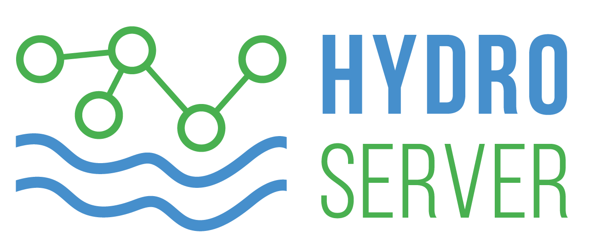&nbsp;&nbsp;&nbsp;&nbsp;&nbsp;&nbsp;&nbsp;

 
 

This repository provides pointers to the HydroServer software stack maintained in GitHub and documentation for HydroServer components. Code repositories for each HydroServer component are linked below.

* Access the [HydroServer GitHub Organization](https://github.com/hydroserver2)
* Access the [HydroServer issue tracker](https://github.com/hydroserver2/hydroserver/issues)
* Access [HydroServer documentation](https://www.hydroserver.org)

## HydroServer Software Components

HydroServer is a software stack made up of multiple components that together enable sensor time series data collection, storage, management, use, and sharing. The following are description of each of HydroServer's major components.

### HydroServer Data Management Web Application 

HydroServer's Data Management Web Application enables users to create and manage monitoring sites, datastreams, and associated metadata. This is HydroServer's main user interface through which users can set up and manage the metadata necessary for loading data. The Data Management App includes:

* A map interface for browsing data collection sites
* A user interface for registering monitoring sites and creating, viewing, and editing site metadata
* A user interface for creating datastreams and associated metadata
* Data visualization tools for monitoring incoming data
* A Job Orchestration System and user interface for configuring automated extraction, transformation, and loading (ETL) of source data to their destinations, data transformation tasks, and automated data monitoring tasks

The HydroServer Data Management App is contained within the main hydroserver code repository in GitHub: [https://github.com/hydroserver2/hydroserver](https://github.com/hydroserver2/hydroserver)

 

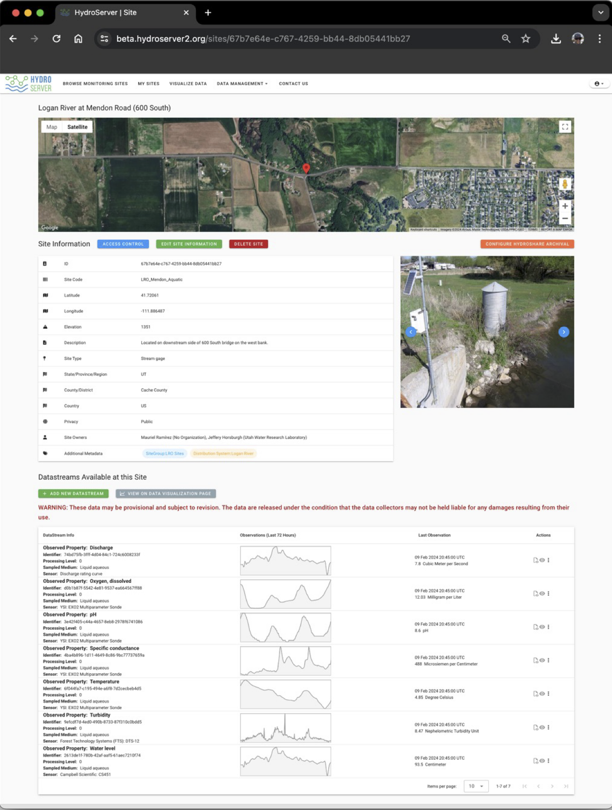

 
 

### HydroServer SensorThings API

HydroServer's SensorThings API implementation is a Python Django plugin that can be added to any Django project. It is an implementation of Version 1.1 Part 1: Sensing of the Open Geospatial Consortium's (OGC) SensorThings API. HydroServer's SensorThings implementation enables the following:

* Data ingest to HydroServer from any device capable of HTTP POST requests (e.g., Internet connected dataloggers, Python scripts or scripts written in other programming languages)
* Data querying and retreival via a REST API with JSON data encodings

HydroServer's SensorThings API implementation is in a separate GitHub repository because it is independent of HydroServer. It is an upstream dependency for HydroServer and was implemented such that it can be added to any Django project to provide SensorThings support: [https://github.com/hydroserver2/django-ogc-sensorthings](https://github.com/hydroserver2/django-ogc-sensorthings)

 

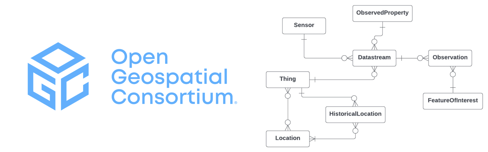

 
 

### HydroServer Data Management API

Because OGC's SensorThings API is a generic Internet of Things (IoT) API, it lacks several metadata elements that are needed in the context of environmental monitoring - e.g., the concept of ownership of monitoring sites and other metadata entities, users and access control, etc. We needed to add these to HydroServer's SensorThings implementation. Because the entities we added do not exist in the OGC specification for SensorThings, we needed to add additional API endpoints to enable creation and management of those entities. HydroServer's Data Management API provides this functionality.

HydroServer's Data Management API is part of the main HydroServer code repository in GitHub: [https://github.com/hydroserver2/hydroserver](https://github.com/hydroserver2/hydroserver)

 

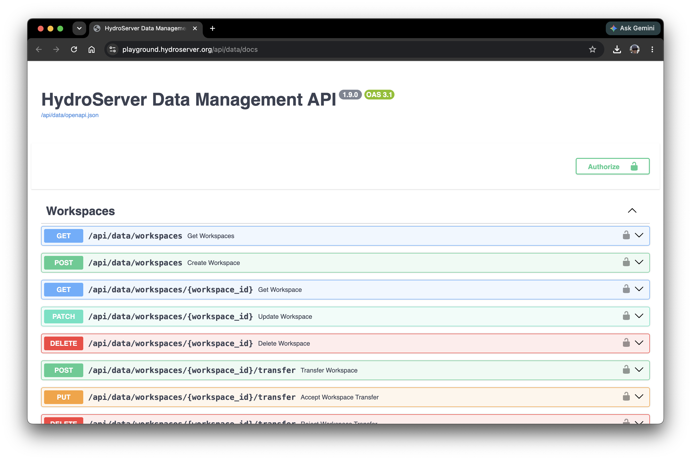

 
 

### HydroServer Streaming Data Loader

 The Streaming Data Loader is a desktop/server software app that can be used for loading streaming data from comma separated values (CSV) files into a HydroServer instance. This can be useful in cases where a monitoring system or organization uses commercial software to manage communications with a sensor network, but regularly downloads data to CSV data files. The Streaming Data Loader can be set up to load data from CSV files any time new data is added to those files. The Streaming Data Loader has the following features:

* Cross platform app for running on Windows, Mac, or Linux
* A graphical user interface that enables users to map the content of a CSV file to datastream metadata in HydroServer (i.e., load data from this CSV column into this datastream in HydroServer)
* Silent updater for loading data to a HydroServer instance from delimited text files (CSV files)
* Automated data loading triggered by any changes to data files (e.g., new observations added)

The Streaming Data Loader Desktop app is contained within its own GitHub repository: [https://github.com/hydroserver2/streaming-data-loader](https://github.com/hydroserver2/streaming-data-loader)

 

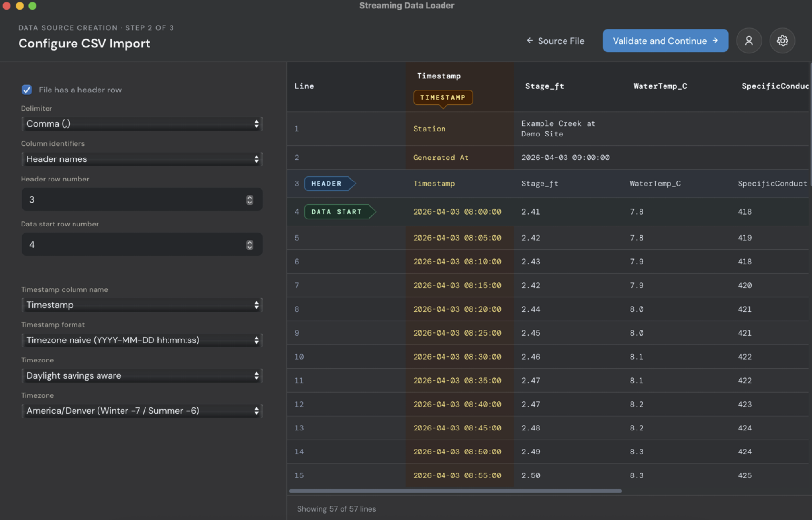

 
 

### HydroServer's Job Orchestration System

HydroServer's Data Management App includes an integrated Job Orchestration System that enables setup, execution, and monitoring of:

* **Any extract, transform, and load (ETL) task** for loading data into HydroServer from any web accessible data source that provides observational data in CSV or JSON format
* **Data transformation and aggregation tasks** - e.g., creating derived datastreams from source datastreams via rating curves, mathematical expressions, and aggregation (subdaily to daily)
* **Automated data monitoring tasks** that check raw data against basic quality control rules such as range checks, missing data checks, rate of change checks, persistence checks, etc.

The Job Orchestration System enables users to set up tasks in the main Data Management App, but then tasks are offloaded and run by a Celery task queue to ensure that they run efficiently without impacting the HydroServer's main web server. The Job Orchestration system is part of the Data Management App within the main HydroServer GitHub repository: [https://github.com/hydroserver2/hydroserver](https://github.com/hydroserver2/hydroserver)

 

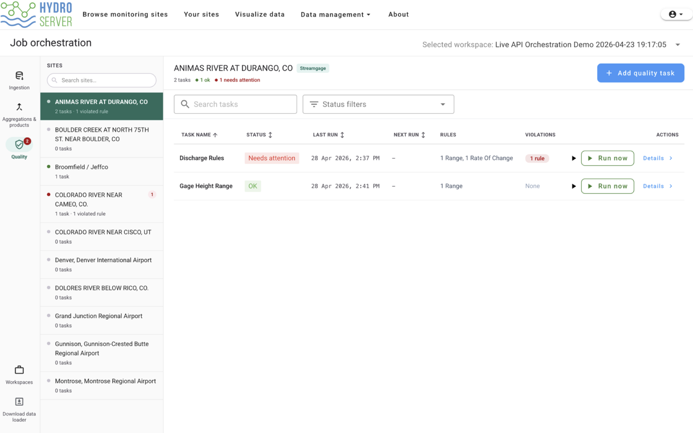

 
 

### HydroServer Data Quality Control (QC) Web Application

HydroServer's Data QC App enables manual/visual quality control of environmental sensor time series data. It provides a graphical user interface for performing the most common data editing tasks required to make sensor data usable:

* Delete data points
* Insert data points
* Adjust or offset data points
* Interpolate data points
* Linear drift correction
* Flagging data points with qualifying comments
* Filtering/selecting data points based on value thresholds, datetime range, change or rate of change threshold, gaps, or persistence

Edits to data in the QC App are recorded in an edit history that becomes an executable record of all of the changes that have been made in editing. Results are written back to the HydroServer database as a separate versioned datastream.  The Data QC App is contained within its own GitHub repository: [https://github.com/hydroserver2/hydroserver-qc-app](https://github.com/hydroserver2/hydroserver-qc-app)

 

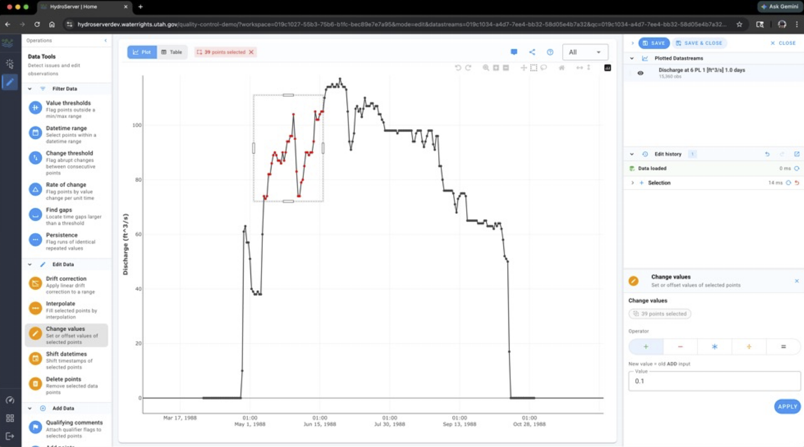

 
 

### HydroServer Python Client Package

HydroServer's Python client package, `hydroserverpy`, is available to make scripting for interacting with HydroServer easier. hydroserverpy provides convenience functions for doing most everything you can do in the web user interface of the Data Management App using Python code. This includes:

* Creating monitoring sites and metadata
* Creating all metadata elements (e.g., observed properties, units, etc.)
* Creating datastream metadata
* Loading data 
* Retrieving data for visualization and analysis

`hydroserverpy` was written specifically for Python, but you can also interact with HydroServer via it's SensorThings API and Data Management API via any other programming language that can interact with a modern REST API. The `hydroserverpy` package is PIP installable from the Python Package index and is part of the main HydroServer repository in GitHub: [https://github.com/hydroserver2/hydroserver](https://github.com/hydroserver2/hydroserver)

There is specific documentation on how to use hydroserverpy, including example code, available via [HydroServer's documentation](https://www.hydroserver.org).

 

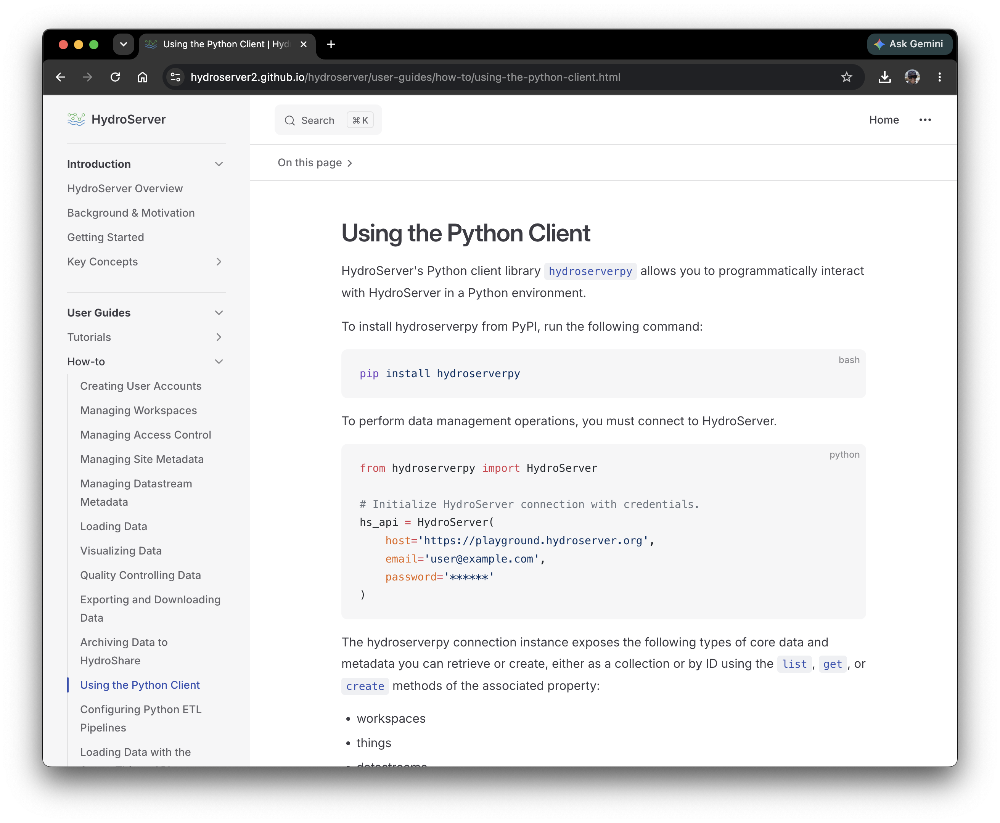

 

### HydroServer TypeScript Client Package

If you are a web developer and you want to build a separate web app that gets data from HydroServer and then provides data visualization and analysis capabilities, HydroServer's TypeScript client provides reusable functionality for efficiently retrieving data from HydroServer via its APIs. This should significantly reduce the amount of code you need to write.

HydroServer's TypeScript client is part of the main HydroServer repository in GitHub: [https://github.com/hydroserver2/hydroserver](https://github.com/hydroserver2/hydroserver)

There is specific documentation on how to use the TypeScript client along with a tutorial on how to build your first app using the TypeScript client available via [HydroServer's documentation](https://www.hydroserver.org).

 

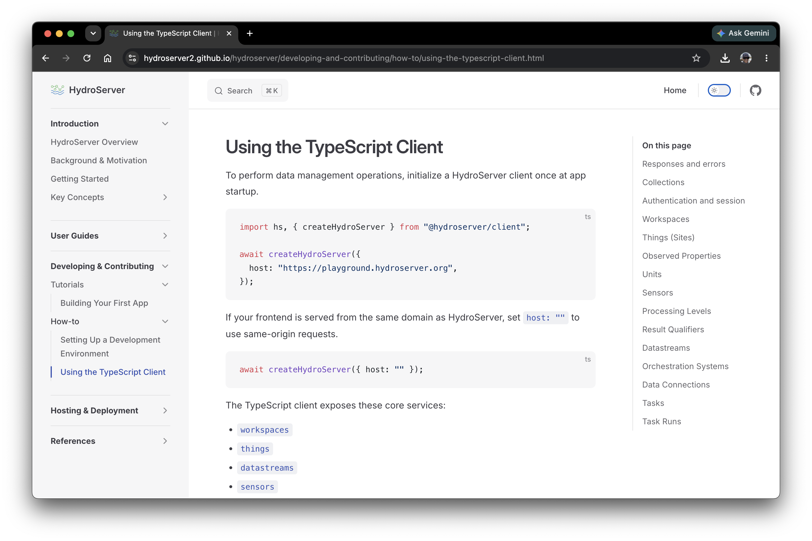

 

## HydroServer Documentation

HydroServer's documentation is available at [https://www.hydroserver.org](https://www.hydroserver.org) and includes the following:

* Introduction to HydroServer and overview information
* Information about HydroServer's playground instance for trying out the software
* Step-by-step tutorials 
* How-to guides for using HydroServer's functionality
* Documentation for developers, including how to set up a developer environment
* Code examples for using HydroServer's APIs and client coding packages (Python client and TypeScript client)
* Instructions for deploying a HydroServer instance
* Reference documentation for HydroServer's APIs and data model

 

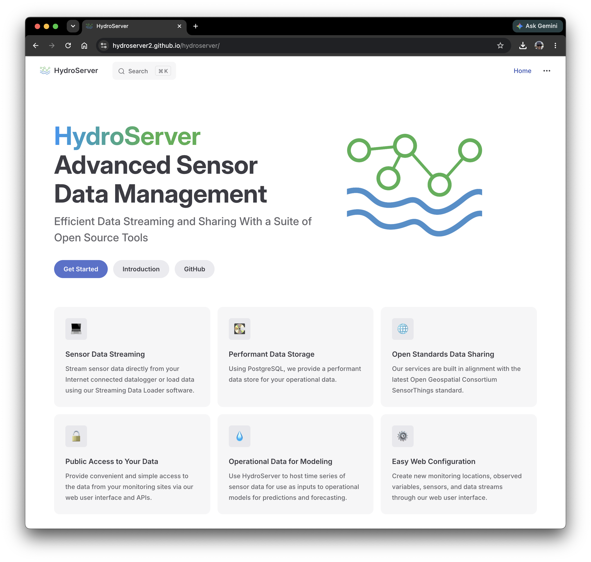

 

## History of HydroServer Development

HydroServer builds on prior efforts and systems established by Utah State University and the Consortium of Universities for the Advancement of Hydrologic Science, Inc. (CUAHSI) [Hydrologic Information System (HIS) project](http://his.cuahsi.org), including the original HydroServer software stack that was created by that project (lovingly referred to as HydroServer 1). The legacy HydroServer (HydroServer 1) software is [archived by CUAHSI](https://github.com/CUAHSI/HydroServer). To acknowledge this legacy, the GitHub organization for this work was called HydroServer 2.

## How to Cite HydroServer

The following are the recommended citations for HydroServer. Both of these papers were published as open access and are available to download for free from the journal's website.

Horsburgh, J. S., Lippold, K., Slaugh, D. L., Ramirez, M. (2024). HydroServer: A software stack supporting collection, communication, storage, management, and sharing of data from in situ environmental sensors, Environmental Modelling & Software, 106637, [https://doi.org/10.1016/j.envsoft.2025.106637](https://doi.org/10.1016/j.envsoft.2025.106637).

Horsburgh, J. S., Lippold, K., Slaugh, D. L. (2025). Adapting OGC’s SensorThings API and data model to support data management and sharing for environmental sensors, Environmental Modelling & Software, 183, 106241, [https://doi.org/10.1016/j.envsoft.2024.106241](https://doi.org/10.1016/j.envsoft.2024.106241).

## Funding and Acknowledgements

Major funding for HydroServer development was provided by the National Oceanic & Atmospheric Administration (NOAA), awarded to the Cooperative Institute for Research to Operations in Hydrology (CIROH) through the NOAA Cooperative Agreement with The University of Alabama (NA22NWS4320003). Additional major funding and support have been provided by the State of Utah Division of Water Rights, the World Meteorological Organization (WMO), and the Utah Water Research Laboratory (UWRL) at Utah State University (USU).

 

&nbsp;
&nbsp;
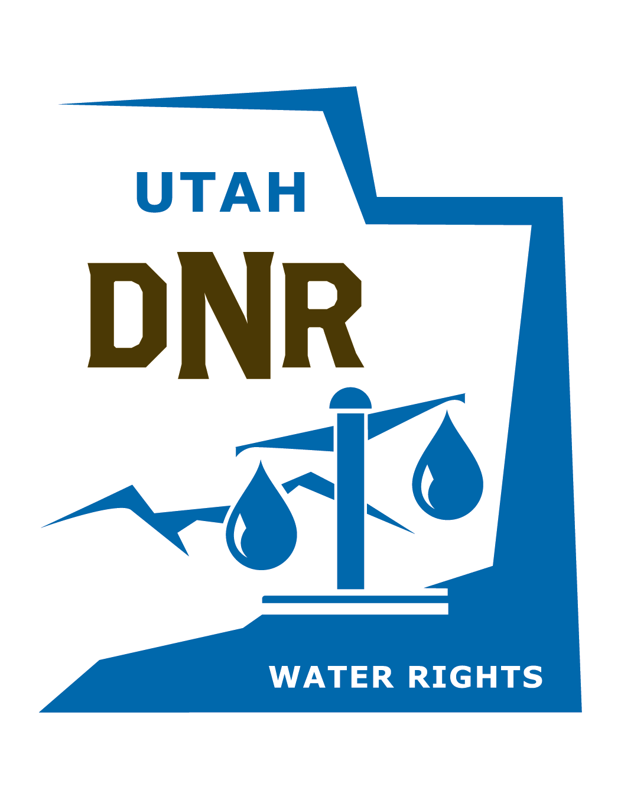&nbsp;
&nbsp;
&nbsp;

 
 
